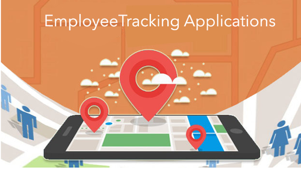
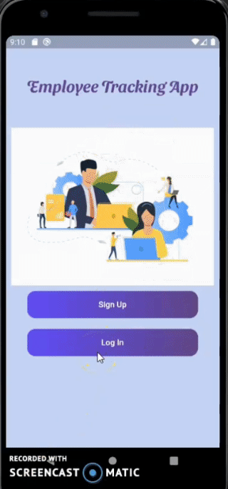

<div align="center">


[](https://flutter.dev/docs)
[](https://firebase.flutter.dev/docs/firestore/usage/ "Firestore")
[](https://code.visualstudio.com/  "Visual Studio Code")

</div><p align="center">
  <a href="" rel="noopener">
 </a>
 
</p>
<h1 align = 'center'><b>Employee Trackology</b></h1>

## Description ##
Maintaining the daily records of employees attendance ,their leaves status physically consumes ample amount of time and there are chances of making mistakes .Thus there is a need to have a software application which helps employees  to keep track of  their attendance ,leave status. 
<p>Hence this application helps employees and the employer in making the process of tracking attendance, leaves which in turn reduces workload and thus increases efficiency.
<!--
<p>
For more details-
<a href="">
Document link 
</a>
</p>
-->

------------------------------------------
## Features ##

<b>Employee</b> 
- Sign In and Sign Up
- Can apply for leave 
- Get status of his leave applications
- Browse  through holidays list 
- Can mark his attendance
- View his attendance history

 <b>Admin</b> 
- Sign In
- Can add holidays for the office
- View employees
- Approve or Reject leave applications
- Get employee details who applied for leave
- Browse through employee details 
- View attendance history of employees
------------------------------------------
## Demo ##
Sign Up/Sign In



Admin Panel


Employee Panel


------------------------------------------

## How To Use
#### Software Requirements
VSCode or Android Studio

## Installation
Install the dependencies by running:
```html  
flutter pub get
```


#### Run using Command Prompt

```html
    flutter run
```

---
###             Tech stack
`Database` : Firestore <br>
`Frontend` : Flutter  <br>


<p>
For more details-
<a href="https://firebase.google.com/docs/functions/get-started">
 Firebase Cloud Functions  </a>
</p>

Flutter Documentation-
<a href="https://flutter.dev/docs">
 Flutter </a> 
</p>

Dart Programming-
<a href="https://dart.dev/guides">
 Dart </a> 
</p>
------------------------------------------

<h3 align="center"><b>Developed  by <a href="https://github.com/hasti-15">Hasti Shah</a> , <a href="https://github.com/nishigthb">Nishi Shah</a> and <a href="https://github.com/hiral72">Hiral Sheth</a></b></h3>

